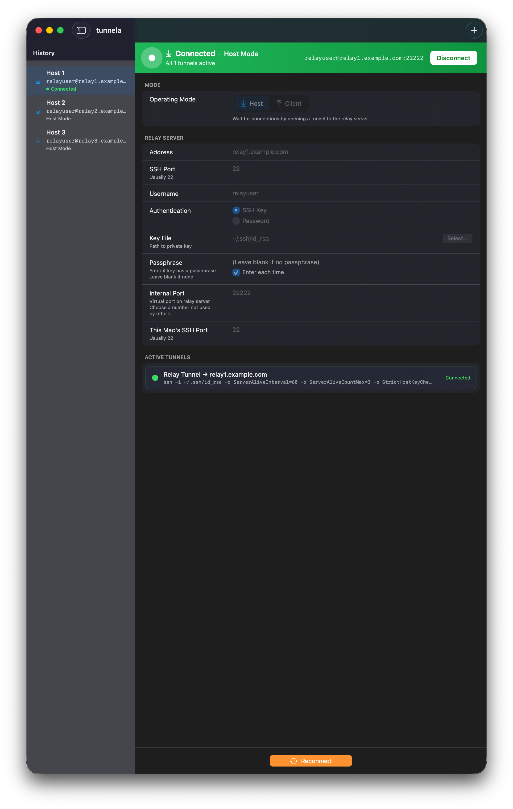
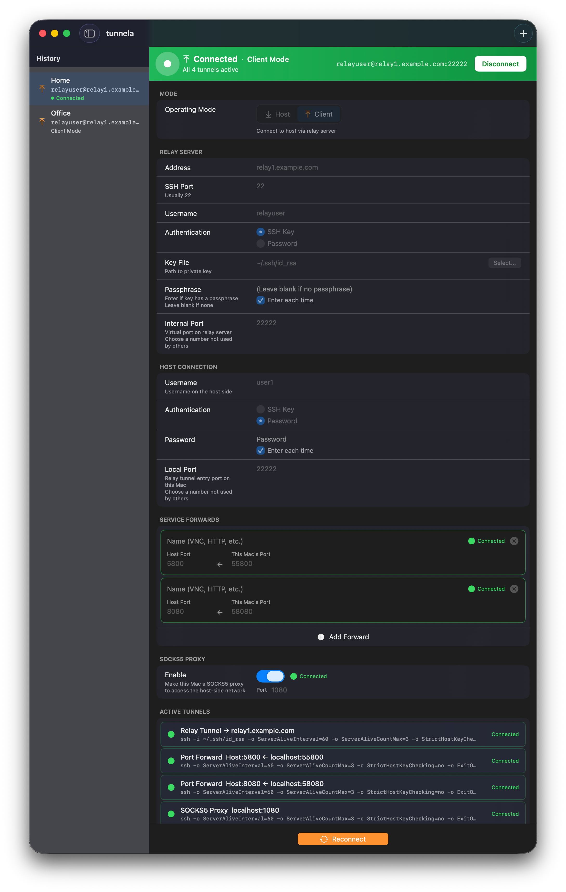

# tunnela

拠点の異なる2台のMac間で、SSHポートフォワーディングによるポートアクセスを実現するためのSSHトンネル構成を支援するmacOSアプリです。各拠点のMacに固定IPアドレスやポート開放は不要です。双方からSSH接続ができる中継サーバーがあれば動作します。

*A macOS app that helps configure SSH tunnels for port forwarding between two Macs at different locations. Neither Mac needs a fixed IP address or open ports — a relay server that both Macs can SSH into is all that's required.*

---

## ダウンロード

最新バージョンは[リリースページ](../../releases/latest)からダウンロードできます。

## 概要

- **ホストモード** — 中継サーバーへリバーストンネルを張り、固定IPやポート開放なしで接続を受け付ける
- **クライアントモード** — 中継経由でホストに接続し、任意のポートへのサービス転送やSOCKS5プロキシも利用できる

接続履歴はローカルに保存されます。接続中でもサービス転送のホット追加・削除が可能です。

## 動作環境

macOS 13.0 以降

## 技術情報

| 役割 | コマンド |
|------|---------|
| ホストのリバーストンネル | `ssh -R <内部ポート>:localhost:<SSHポート> user@中継` |
| クライアントの中継トンネル | `ssh -L <ローカルポート>:localhost:<内部ポート> user@中継` |
| サービス転送 | `ssh -p <ローカルポート> -L <local>:localhost:<target> user@localhost` |
| SOCKS5プロキシ | `ssh -D <ポート> -N -p <ローカルポート> user@localhost` |

- ホスト側は自動再接続（10秒間隔、autossh 不要）
- パスワード・パスフレーズは保存または都度入力を選択可能
- 日本語・英語のローカライズ対応
